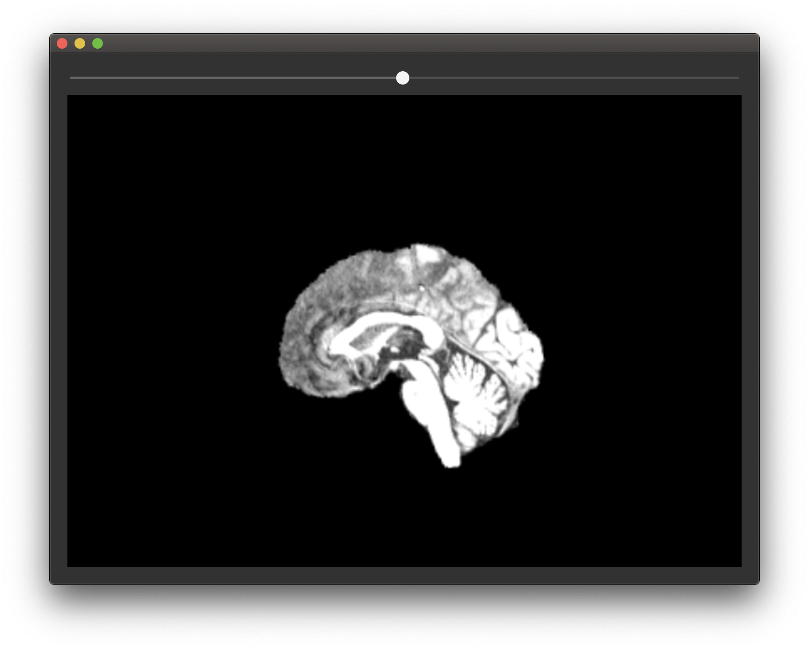
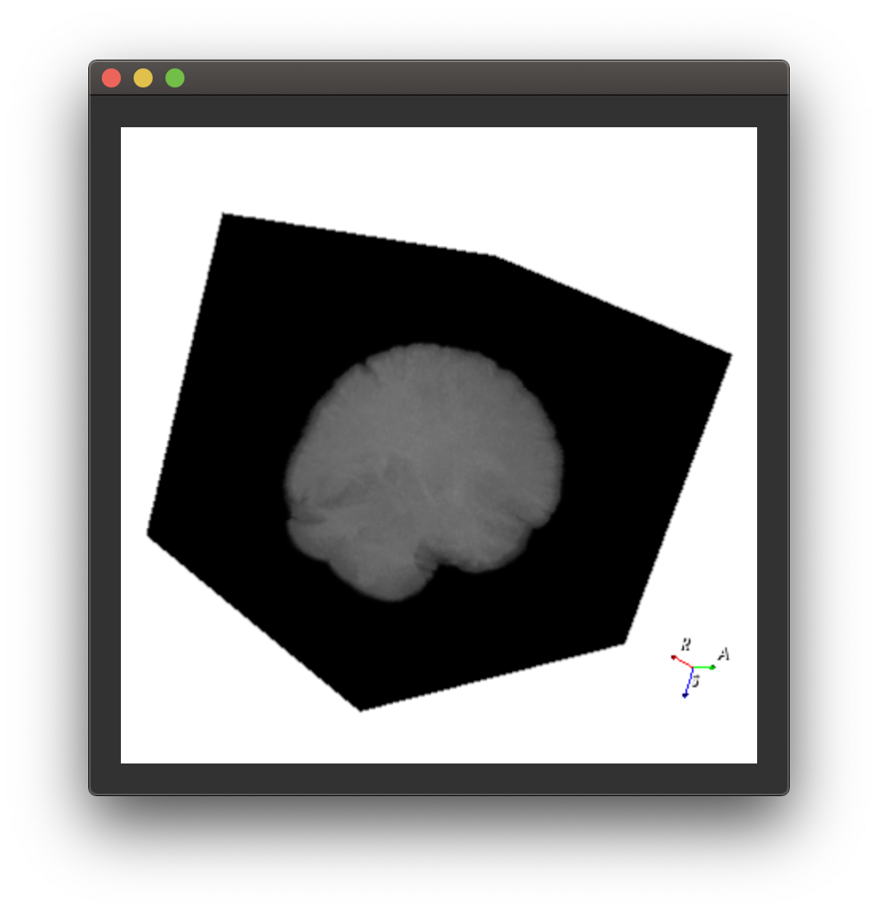
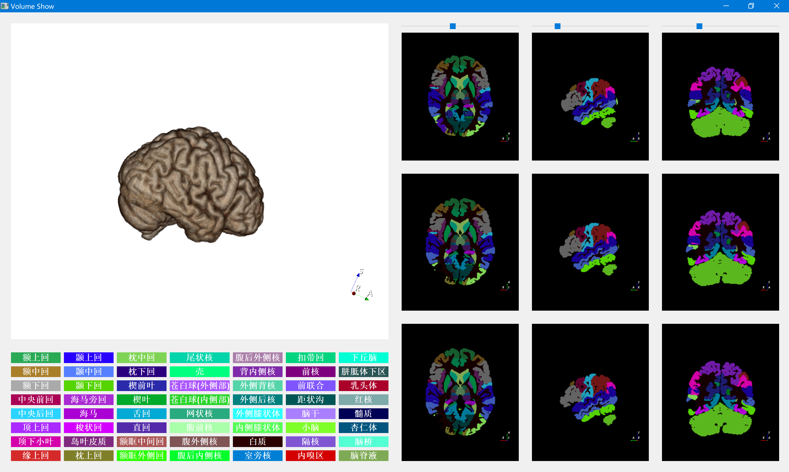

# Medical Image Visualization Demo

## Requirements

- python 3.6 or upper
- vtk==8.1.2
- PySide2==5.14.1
- itk(Optional for further process)

## Run

- for 2D slice

`python QSliceViewWidget.py`

- for 3D volume

`python QVolumeViewWidget.py`
Tips: you need set your own vtkColorTransferFunction for 3d render

## Show

